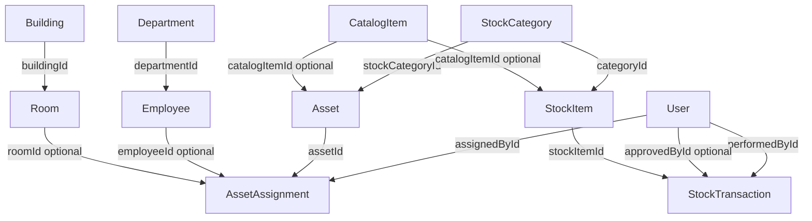

/**
 * @file db-schema.md
 * @description Complete database schema reference and relationship chart for ITMS.
 */

# Database Schema Reference

This document describes the current Prisma data model used by the IT Management System after schema cleanup.

## Core entities

- `User`: authenticated IT staff accounts with role and active-status controls.
- `Asset`: tracked IT equipment unit records with identifiers, status, and system fields.
- `AssetAssignment`: assignment history linking assets to employees and/or rooms with audit metadata.
- `StockCategory`: category source of truth for inventory and asset-tag prefixes.
- `StockItem`: inventory lines with quantity, SKU, thresholds, and optional catalog linkage.
- `StockTransaction`: immutable stock movement history for IN/OUT/RETURN/ADJUSTMENT events.
- `CatalogItem`: unified product identity shared between stock and assets.
- `Employee`: organizational recipients with department and contact metadata.
- `Department`: employee grouping for organization and reporting.
- `Building`: top-level physical location container.
- `Room`: location units under buildings used by assignment workflows.

## Enums

- `Role`: `ADMIN`, `MEMBER`
- `AssetStatus`: `AVAILABLE`, `DEPLOYED`, `MAINTENANCE`, `RETIRED`, `DISPOSED`
- `Condition`: `NEW`, `GOOD`, `FAIR`, `POOR`, `DEFECTIVE`
- `RoomType`: `OFFICE`, `COMLAB`, `CLASSROOM`, `SERVER_ROOM`, `STORAGE`, `CLINIC`, `OTHER`
- `Title`: `DR`, `MR`, `MS`, `PROF`
- `TransactionType`: `IN`, `OUT`, `ADJUSTMENT`, `RETURN`

## Relationship chart

## Cardinality notes

- One `Building` has many `Room` rows.
- One `Department` has many `Employee` rows.
- One `Asset` has many `AssetAssignment` rows over time.
- `AssetAssignment.employeeId` and `AssetAssignment.roomId` are optional so assignments can be person-only or location-only.
- One `StockItem` has many `StockTransaction` rows.
- One `CatalogItem` can map to many `Asset` and many `StockItem` rows.
- One `StockCategory` can map to many `Asset` and many `StockItem` rows.

## Constraint highlights

- Unique identifiers: `assetTag`, optional `pcNumber`, optional `serialNumber`, optional `ipAddress`, `sku`, `email`-based auth and employee IDs.
- Audit-safe flows depend on assignment and stock transaction history; mutation guards in services enforce this behavior.
